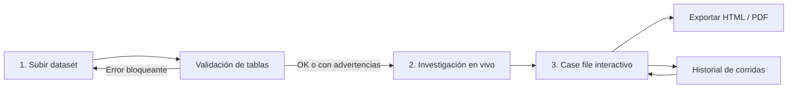

# EXAMPLE.md — Cómo debe renderizar el frontend una investigación

> Guía para el equipo de frontend. Explica **qué** se muestra, **cómo** se muestra y
> **por qué**, desde que el usuario sube su dataset hasta que lee (y exporta) el case file.
>
> **Estado:** propuesta de diseño. Los endpoints de investigación (`/api/v1/runs/...`) y el
> "report view-model" descritos aquí **todavía no existen** en el backend. Lo que sí es fijo
> es el contrato oficial del reto: `public/material/submission_schema.json` y
> `public/material/case_file_structure.md`. Todo lo propuesto está construido encima de eso.
>
> Contexto general del proyecto: [`CONTEXT.md`](CONTEXT.md).

---

## Índice

1. [Qué problema resuelve la pantalla](#1-qué-problema-resuelve-la-pantalla)
2. [Reglas que condicionan el diseño](#2-reglas-que-condicionan-el-diseño)
3. [Flujo completo](#3-flujo-completo)
4. [Pantalla 1 — Subir dataset](#4-pantalla-1--subir-dataset)
5. [Pantalla 2 — Investigación en vivo](#5-pantalla-2--investigación-en-vivo)
6. [Pantalla 3 — Case file interactivo](#6-pantalla-3--case-file-interactivo)
7. [Componentes en detalle](#7-componentes-en-detalle)
8. [Qué debe mandar el backend (view-model)](#8-qué-debe-mandar-el-backend-view-model)
9. [Endpoints propuestos](#9-endpoints-propuestos)
10. [Tipos TypeScript](#10-tipos-typescript)
11. [Estados vacíos, errores y casos borde](#11-estados-vacíos-errores-y-casos-borde)
12. [Textos y lenguaje](#12-textos-y-lenguaje)
13. [Stack sugerido](#13-stack-sugerido)
14. [Exportación offline](#14-exportación-offline)
15. [Checklist para dar la pantalla por terminada](#15-checklist-para-dar-la-pantalla-por-terminada)

---

## 1. Qué problema resuelve la pantalla

El usuario (un equipo de finanzas o auditoría, o un juez del hackathon) sube los libros de una
empresa: proveedores, facturas, ledger, transacciones bancarias, órdenes de compra, contratos,
empleados y la lista EFOS del SAT. El backend investiga y devuelve:

- **Hallazgos**: acusaciones probadas, con regla violada, monto en pesos y rastro de evidencia.
- **Leads descartados**: entidades que parecían sospechosas, se investigaron y **no** se
  acusaron, con la razón.
- **Metadatos de ejecución**: llamadas al LLM, costo en MXN, segundos y si la corrida es
  determinista.

La pantalla tiene que responder, en este orden:

1. **¿Está bien o hay fraude?** (en 5 segundos)
2. **¿Qué pasó, quién está involucrado y cuánto dinero?** (en 30 segundos)
3. **¿Por qué debo creerlo?** (evidencia, a uno o dos clics)
4. **¿A quién no acusaron y por qué?** (con el mismo peso que los hallazgos)

Principio rector: **divulgación progresiva**. Arriba va el veredicto, en medio la explicación y
abajo la evidencia cruda. Nadie tiene que leer un JSON ni una tabla de 3,000 filas para entender
el resultado, pero si quiere, puede.

---

## 2. Reglas que condicionan el diseño

Estas reglas vienen del material oficial y **no son negociables**:

| Regla | Fuente | Qué implica en la UI |
|---|---|---|
| Un lector **no técnico** debe entender el case file sin ayuda | `case_file_structure.md` | Lenguaje llano, tooltips para términos (CFDI, CLABE, 69-B), nada de jerga estadística. |
| El money trail debe ser **un diagrama**, no prosa (si es prosa, Clarity queda topado en 3) | `case_file_structure.md` | Componente de grafo obligatorio en cada hallazgo, también en la exportación. |
| Cada paso del money trail cita un `exhibit_id` | `submission_schema.json` | Cada flecha muestra un chip `EX-xx` que abre la evidencia. |
| Los leads no perseguidos van **en el cuerpo**, no en un apéndice | `case_file_structure.md` | Tab o sección de primer nivel, no un acordeón escondido al final. |
| Acusar a un decoy pesa **al menos igual** que no encontrar fraude | `README.md` del material | Los descartados se muestran con la misma jerarquía visual que los hallazgos. |
| Las preguntas de los jueces se contestan "desde un log o una página en menos de 10 segundos" | `README.md` del material | Buscador por entidad y log de investigación accesible. |
| El case file se produce **sin llamadas de red** | `case_file_structure.md` | Exportación HTML/PDF autocontenida: sin CDNs ni fuentes remotas. |
| Orden de secciones: Header → Resumen → Hallazgos → Leads no perseguidos → Método y límites | `case_file_structure.md` | Ese mismo orden en la vista y en la exportación. |

---

## 3. Flujo completo



Cada investigación es una **corrida** (`run`) con un `run_id` persistente. Recargar la página
o compartir el link `/runs/{run_id}` debe mostrar exactamente el mismo resultado, **sin volver
a investigar**. Esto es parte del requisito de determinismo y replay offline.

---

## 4. Pantalla 1 — Subir dataset

### 4.1 Qué acepta

El formato final todavía no está decidido, así que el uploader debe aceptar:

| Formato | Cómo llega | Nota |
|---|---|---|
| `.zip` | Un CSV por tabla (`vendors.csv`, `invoices.csv`, …) | Es lo que genera hoy `estate-generate`. |
| `.csv` | Uno o varios archivos sueltos | Se mapea por nombre de archivo o por columnas. |
| `.xlsx` | Una hoja por tabla | El nombre de la hoja es el nombre de la tabla. |
| `.db` / `.sqlite` | SQLite con las 8 tablas | Es lo que usa `validate_format.py --estate`. |
| `.sql` | Dump con `CREATE TABLE` + `INSERT` | |

El frontend **no parsea** el contenido: sube el archivo y el backend responde con el
diagnóstico. El frontend solo valida extensión y tamaño antes de enviar.

### 4.2 Qué se muestra

```
┌───────────────────────────────────────────────────────────┐
│   ⬆  Arrastra aquí los libros de la empresa              │
│      .zip · .csv · .xlsx · .db · .sql   (máx. N MB)       │
└───────────────────────────────────────────────────────────┘

Tablas detectadas
 ✔ vendors           128 filas
 ✔ invoices        1,240 filas
 ✔ ledger          4,982 filas
 ✔ bank_txns       3,010 filas
 ✔ purchase_orders   611 filas
 ⚠ contracts           0 filas   → sin contratos no se puede verificar alcance de servicios
 ✔ employees          45 filas
 ✖ efos_list       no encontrada → sin lista EFOS no corre el detector de proveedores 69-B

 Columnas: 2 advertencias  [ver detalle]

            [ Cancelar ]   [ Iniciar investigación ]
```

### 4.3 Reglas de comportamiento

- **Verde (✔)**: la tabla existe y trae las columnas de `estate_schema.sql`.
- **Amarillo (⚠)**: la tabla falta, está vacía o le faltan columnas opcionales. Se puede
  investigar, pero la UI explica **qué capacidad se pierde**, en una frase.
- **Rojo (✖)**: falta algo imprescindible (por ejemplo `invoices` o `bank_txns`) o el archivo
  no se pudo leer. El botón "Iniciar investigación" queda deshabilitado.
- Las advertencias de columnas se abren en un panel: `invoices.metodo_pago` falta, se
  esperaba `PUE | PPD`.
- Estas advertencias deben reaparecer después en la sección **Método y límites** del case file,
  para que el lector sepa que el análisis fue parcial.

---

## 5. Pantalla 2 — Investigación en vivo

### 5.1 Por qué existe

Durante el demo de 3 minutos, los jueces esconden un esquema y el agente tiene que "seguir el
dinero en pantalla". Una barra de progreso genérica no sirve: hay que **mostrar el
razonamiento mientras ocurre**.

### 5.2 Qué se muestra

```
Investigando…                                   00:47  ·  18 llamadas LLM  ·  $1.20 MXN

● Cargando estate                                          ✔ 8 tablas, 10,016 registros
● Detector: proveedores en lista EFOS                      ⚠ 3 coincidencias
● Detector: pagos que no cuadran con facturas              ⚠ 5 casos
● Detector: dinero que regresa en círculo                  ⚠ 1 ciclo
● Investigador → siguiendo pagos a RFC:CAMS850101AB2       … consultando bank_txns
   └ encontró 4 transferencias a CLABE 0121…3344 (empleado EMP:0012)
● Challenger → intenta refutar hallazgo #1                 … 
● Validator → reconciliación hallazgo #1                   ✔ diferencia 0.4 %
● Lead cerrado: RFC:PELO790312XY1                          🟡 Sentencia Favorable en 69-B
```

### 5.3 Reglas de comportamiento

- Los eventos llegan por **SSE** (ver [§9](#9-endpoints-propuestos)). Cada evento se agrega al
  final, con autoscroll que se pausa si el usuario sube a leer.
- Los contadores de arriba (tiempo, llamadas LLM, costo) se actualizan en vivo.
- Los RFC y `EMP:` que aparecen en el log son chips con tooltip del nombre de la entidad.
- Iconos por rol: 🔎 detector, 🕵️ investigador, ⚔️ challenger, ✅ validator.
- Al terminar, transición automática al case file, con opción de "ver log completo".
- Si la conexión SSE se cae, se reconecta y pide los eventos desde el último `seq` recibido.
- Si el usuario cierra la pestaña, la corrida **sigue** en el backend. Al volver a
  `/runs/{run_id}` se ve el progreso o el resultado final.
- Este mismo log se guarda y es el que después contesta "¿por qué no marcaste a X?".

---

## 6. Pantalla 3 — Case file interactivo

### 6.1 Layout general

```
┌──────────────────────────────────────────────────────────────────────────┐
│ HEADER  Industrias Norte SA de CV · Ene–Dic 2026 · Seed 7                │
│         42 llamadas LLM · $3.10 MXN · 81 s · ✔ Determinista   [Exportar] │
├──────────────────────────────────────────────────────────────────────────┤
│ RESUMEN EJECUTIVO                                                         │
│  ┌────────────┐ ┌──────────────┐ ┌──────────────┐ ┌────────────────┐     │
│  │ 🔴 2        │ │ 💰 $1,284,000 │ │ 🟡 7          │ │ 🟢 118          │     │
│  │ hallazgos   │ │ exposición    │ │ leads cerrados│ │ sin señales     │     │
│  │ 1 proven    │ │ total MXN     │ │ sin acusación │ │                 │     │
│  │ 1 probable  │ │               │ │               │ │                 │     │
│  └────────────┘ └──────────────┘ └──────────────┘ └────────────────┘     │
│  "Encontramos un proveedor fantasma que facturó $139,200 por servicios   │
│   nunca prestados y una red de moches de $1,144,800 a través de una      │
│   empresa fachada. Revisamos otros 7 proveedores sospechosos y ninguno   │
│   se sostuvo."                                                            │
├───────────────┬──────────────────────────────────────────────────────────┤
│ 🔴 Hallazgos 2 │                                                          │
│ 🟡 Descartados 7│         Contenido de la sección activa                  │
│ 🕸 Entidades    │                                                          │
│ 📄 Transacciones│                                                          │
│ 🕒 Log          │                                                          │
│ ℹ Método/límites│                                                          │
└───────────────┴──────────────────────────────────────────────────────────┘
```

- En escritorio: navegación lateral fija. En móvil: tabs horizontales con scroll.
- **Header y resumen siempre visibles** arriba (el resumen se colapsa a una línea al hacer scroll).
- Los contadores del resumen son **clicables**: 🔴 lleva a Hallazgos, 🟡 a Descartados y 🟢
  a Entidades filtradas por "sin señales".
- La URL refleja la sección y el elemento abierto (`/runs/abc/findings/1?exhibit=EX-03`), para
  poder compartir un link directo a una evidencia.

### 6.2 Secciones y su propósito

| Sección | Obligatoria por el reto | Responde |
|---|---|---|
| Header | Sí | ¿De qué empresa y corrida hablamos, y cuánto costó? |
| Resumen ejecutivo | Sí | ¿Hay fraude? ¿Cuánto? |
| Hallazgos | Sí | ¿Qué pasó y cómo lo sabemos? |
| Descartados (leads no perseguidos) | Sí, **en el cuerpo** | ¿Por qué no acusaron a X? |
| Entidades | No (valor agregado) | ¿Cómo se relaciona todo? ¿Cuál es el estado de cada proveedor? |
| Transacciones | No (valor agregado) | Quiero ver todos los datos. |
| Log | No, pero ayuda con la regla de "10 segundos" | ¿Qué hizo el agente paso a paso? |
| Método y límites | Sí | ¿Qué no puede detectar? ¿Cómo lo reproduzco? |

---

## 7. Componentes en detalle

### 7.1 `RunHeader`

Muestra: nombre de la empresa, RFC de la empresa, periodo auditado, seed, `llm_calls`,
`mxn_cost`, `wall_clock_seconds` y `deterministic`.

- `deterministic: true` → badge verde "Determinista: la misma seed produce el mismo resultado".
- `deterministic: false` → badge gris "No determinista", con tooltip que lo explica.
- `cost_by_role` (si viene) va en un popover: investigador $X, challenger $Y, validator $Z.
- Formato de costo: `$3.10 MXN`. Formato de tiempo: `81 s`, o `2 min 14 s` si pasa de 60.
- Botón **Exportar** (ver [§14](#14-exportación-offline)).

### 7.2 `ExecutiveSummary`

- 4 tarjetas KPI: hallazgos (con desglose proven/probable), exposición total, leads cerrados y
  entidades sin señales.
- **Exposición total** = suma de `peso_amount` de todos los hallazgos. El backend la manda ya
  calculada (`summary.total_exposure`); el frontend no suma por su cuenta, para evitar
  diferencias de redondeo con el PDF.
- Un párrafo de 2 a 4 frases en lenguaje llano (`summary.headline`), generado por el backend.
- **Veredicto global** como banner de color:

| Condición | Banner | Texto sugerido |
|---|---|---|
| ≥1 hallazgo `proven` | 🔴 rojo | "Se encontró fraude comprobado." |
| Solo hallazgos `probable` | 🟠 naranja | "Hay indicios fuertes de fraude que requieren confirmación." |
| 0 hallazgos, ≥1 lead cerrado | 🟢 verde | "No se encontró fraude comprobable. Se revisaron N casos sospechosos y todos se descartaron." |
| 0 hallazgos, 0 leads | 🟢 verde | "No se detectaron señales de fraude en los datos analizados." |
| Tablas faltantes | ⚠ se agrega al banner | "Análisis parcial: faltó la tabla `contracts`." |

> Un resultado vacío **es válido y es un buen resultado** (`findings: []` es legítimo según el
> schema). No hay que mostrarlo como error ni como pantalla vacía: tiene que verse como un
> informe limpio, con los descartados visibles como prueba de que sí se investigó.

### 7.3 `EntityStatusBadge` (el semáforo)

Es el lenguaje visual de toda la app. Cada entidad (`RFC:…`, `EMP:…`) tiene **un** estado:

| Estado | Color | Significado | Origen |
|---|---|---|---|
| `accused` | 🔴 rojo | Aparece en `entities` de algún hallazgo | `findings[].entities` |
| `declined` | 🟡 ámbar | Se investigó y se descartó | `leads_not_pursued[].entity` |
| `clear` | 🟢 verde | Ningún detector la señaló | resto de entidades |

Reglas:
- Usar siempre **color + icono + texto**, nunca solo color (accesibilidad y daltonismo).
- Si una entidad está en un hallazgo y además en un lead, gana `accused`.
- Mostrar el badge en todos los lugares donde aparezca la entidad: tablas, grafo, log, drawers.

### 7.4 `FindingCard` (una por hallazgo)

Sigue **exactamente** el orden de `case_file_structure.md`:

```
┌──────────────────────────────────────────────────────────────────────┐
│ #1  CONSULTORES AMSA SA DE CV   RFC:CAMS850101AB2                     │
│     [Proveedor fantasma]  🔴 proven                         $139,200  │
├──────────────────────────────────────────────────────────────────────┤
│ REGLA VIOLADA                                                         │
│ ▌ SAT Artículo 69-B CFF: operaciones inexistentes                     │
├──────────────────────────────────────────────────────────────────────┤
│ QUÉ PASÓ                                                              │
│ La empresa pagó dos facturas a Consultores AMSA por "asesoría          │
│ estratégica". El proveedor está en la lista definitiva del SAT, se     │
│ registró 12 días antes de la primera factura, no tiene contrato ni     │
│ orden de compra, y su cuenta bancaria es la misma que la del empleado  │
│ que aprobó los pagos.                                                  │
├──────────────────────────────────────────────────────────────────────┤
│ RASTRO DEL DINERO                                     [diagrama]      │
│                                                                        │
│  [Empresa] ──$92,800 · 29 mar · EX-05──▶ [CONSULTORES AMSA]            │
│                                               │                        │
│                                  $46,400 · 16 abr · EX-06              │
│                                               ▼                        │
│                                     [CLABE 0121…3344]                   │
│                                     = EMP:0012 Juan P. (aprobador)      │
├──────────────────────────────────────────────────────────────────────┤
│ EVIDENCIA                                                             │
│ EX-01  invoices   INV-00001   Factura de $92,800 sin OC ni contrato  ↗│
│ EX-02  invoices   INV-00002   Factura de $46,400, mismo concepto     ↗│
│ EX-03  vendors    CAMS850…    Registrado 12 días antes de facturar   ↗│
│ EX-04  efos_list  CAMS850…    Estatus "definitivo" en la lista 69-B  ↗│
│ …                                                                     │
├──────────────────────────────────────────────────────────────────────┤
│ RECONCILIACIÓN                                                        │
│   EX-01  $ 92,800.00                                                  │
│ + EX-02  $ 46,400.00                                                  │
│ ─────────────────────                                                 │
│ = $139,200.00   monto reclamado $139,200.00   ✔ diferencia 0.00 %     │
├──────────────────────────────────────────────────────────────────────┤
│ ⚔ REVISIÓN ADVERSARIAL                                    [expandir]  │
│ Argumento: "El proveedor podría ser real y solo estar mal registrado." │
│ Por qué sobrevivió: "No hay contrato, OC ni entregable, y la CLABE     │
│ coincide con la del aprobador (EX-07)."                                │
└──────────────────────────────────────────────────────────────────────┘
```

Detalle de cada bloque:

**Heading**
- Nombre legal (de `entities` del view-model) + id con prefijo (`RFC:…`), que se puede copiar.
- Si hay varias entidades, la principal va en el título y el resto como chips debajo.
- Badge del esquema con nombre traducido y tooltip explicativo:

| `scheme_type` | Etiqueta | Tooltip en lenguaje llano |
|---|---|---|
| `phantom_vendor` | Proveedor fantasma | Un proveedor que cobra por trabajos o productos que nunca se entregaron. |
| `kickback` | Moche / soborno | Un pago inflado a un proveedor, que regresa parte del dinero a alguien de la empresa, normalmente por una empresa fachada. |
| `round_tripping` | Dinero en círculo | El dinero sale de la empresa, pasa por terceros y regresa, para simular operaciones. |
| `threshold_splitting` | Fraccionamiento | Una compra grande partida en varias pequeñas para no pasar el límite de aprobación. |
| `revenue_inflation` | Ventas infladas | Ventas registradas que no ocurrieron, para aparentar más ingresos. |

**Regla violada**
- Texto de `rule_broken` destacado (borde lateral de color). Nunca se trunca.

**Monto y confianza**

| `confidence` | Badge | Tooltip |
|---|---|---|
| `proven` | 🔴 Comprobado | La evidencia demuestra el esquema y el monto cuadra con los registros. |
| `probable` | 🟠 Probable | La evidencia apunta con fuerza al esquema, pero falta un eslabón (por ejemplo, un movimiento bancario de un tercero no visible). |

Monto con formato `es-MX`: `$139,200.00 MXN`.

**Qué pasó**
- `narrative` tal cual (máx. 150 palabras, ya viene en lenguaje llano).
- Opcional: los RFC y `EX-xx` mencionados en el texto se convierten en chips interactivos.

**Rastro del dinero** → ver [§7.5](#75-moneytraildiagram).

**Evidencia** → ver [§7.6](#76-exhibitstable-y-recorddrawer).

**Reconciliación** → ver [§7.7](#77-reconciliation).

**Revisión adversarial** (si viene `adversarial_review`)
- Colapsada por defecto, con la etiqueta visible "⚔ Revisión adversarial: el hallazgo resistió".
- Muestra argumento del challenger → respuesta → resultado.
- Si no hubo revisión, no se muestra nada (no poner "N/A").

### 7.5 `MoneyTrailDiagram`

**Es el componente más importante para Clarity.** Tiene que funcionar interactivo en la app y
como imagen estática en la exportación.

Datos: `finding.money_trail[]`, donde cada paso es `{from, to, amount, date, exhibit_id}`.

**Nodos**
- Un nodo por valor único de `from` y `to`.
- Etiqueta: nombre legible (del diccionario `entities` del view-model) + id corto.
- Forma e icono por tipo:

| Tipo | Icono | Ejemplo |
|---|---|---|
| Empresa auditada | 🏢 | La empresa dueña de los libros |
| Proveedor | 🏭 | `RFC:CAMS850101AB2` |
| Empleado | 👤 | `EMP:0012` |
| Cuenta bancaria | 🏦 | `CLABE:012180001234567890` (mostrar `0121…7890`) |
| Tercero desconocido | ❔ | Cuenta que no pertenece a ninguna entidad conocida |

- Color del borde según el semáforo de la entidad.

**Aristas**
- Dirección `from → to`, con flecha.
- Etiqueta en 2 líneas: `$92,800` y `29 mar 2026 · EX-05`.
- Grosor proporcional al monto (con mínimo y máximo, para que no desaparezca ninguna).
- Numeración del orden (①②③), porque `money_trail` viene ordenado.
- Hover: resalta la arista y su fila en la tabla de evidencia.
- Clic: abre `RecordDrawer` con el registro del exhibit.

**Layout**
- Izquierda → derecha (`dagre` o `elk`), siguiendo el orden del trail.
- **Round-tripping**: el ciclo tiene que verse como ciclo (la arista final regresa al nodo
  inicial). No hay que "desenrollarlo" en línea recta.
- **Esquemas entrelazados** (dos hallazgos comparten una entidad): el nodo compartido lleva un
  chip "También en hallazgo #2" que navega a ese hallazgo.

**Controles**
- Zoom, pan, "ajustar a pantalla" y "descargar PNG/SVG".
- En móvil: el diagrama cambia a lista vertical de pasos (cada paso es una tarjeta con flecha
  hacia abajo). **Sigue siendo un diagrama**, no un párrafo.

**Accesibilidad**
- Debajo del grafo, una tabla alternativa (colapsada) con los mismos pasos:
  `# · De · A · Monto · Fecha · Evidencia`.

### 7.6 `ExhibitsTable` y `RecordDrawer`

**Tabla de evidencia** (`finding.exhibits[]`):

| Columna | Contenido |
|---|---|
| Exhibit | `EX-01` (ancla, para enlazar desde el diagrama) |
| Fuente | `source_table`, traducida: `invoices` → Factura, `bank_txns` → Transferencia, `ledger` → Póliza contable, `vendors` → Proveedor, `efos_list` → Lista SAT 69-B, `purchase_orders` → Orden de compra, `contracts` → Contrato, `employees` → Empleado |
| Registro | `record_id` (monoespaciado, copiable) |
| Qué prueba | `note` (una frase) |
| Monto | Si la tabla tiene monto (`invoices.total`, `bank_txns.amount`, `purchase_orders.amount`, `contracts.value`) |
| | Botón ↗ para abrir el registro |

**Drawer del registro** (panel lateral derecho):

```
┌──────────────────────────────────────────┐
│ EX-01 · Factura INV-00001           [✕]  │
│ Qué prueba: Factura de $92,800 sin OC    │
│ ni contrato.                             │
├──────────────────────────────────────────┤
│ uuid           INV-00001                 │
│ issuer_rfc     CAMS850101AB2  🔴 ↗        │
│ receiver_rfc   EMP920101AB1              │
│ issue_date     2026-03-29                │
│ subtotal       $80,000.00                │
│ iva            $12,800.00                │
│ total          $92,800.00   ◀ citado     │
│ concepto_text  "Asesoría estratégica"    │
│ uso_cfdi       G03  ⓘ Gastos en general  │
│ metodo_pago    PUE  ⓘ Pago en una sola… │
│ status         vigente                   │
├──────────────────────────────────────────┤
│ Aparece también en: Hallazgo #1 (EX-01)  │
│ Registros relacionados:                  │
│  • Póliza 3312 (ledger)            ↗     │
│  • Transferencia TXN-0891 (bank)   ↗     │
└──────────────────────────────────────────┘
```

- Muestra **todas** las columnas del registro, con las etiquetas originales del schema (los
  jueces leen esos nombres directamente) y una traducción en tooltip.
- Resalta los campos relevantes (`highlight_fields` en el view-model).
- Las RFC, CLABE y `EMP:` son enlaces a la entidad.
- Tooltips para códigos SAT: `uso_cfdi`, `forma_pago`, `metodo_pago`, `status`.
- "Registros relacionados" permite seguir el rastro a mano: factura → póliza → pago.

### 7.7 `Reconciliation`

Hace visible la aritmética que valida el monto:

```
Tabla usada para reconciliar: invoices (total)

   EX-01  INV-00001   $ 92,800.00
 + EX-02  INV-00002   $ 46,400.00
 ──────────────────────────────────
 = Suma de evidencia  $139,200.00
   Monto reclamado    $139,200.00
   Diferencia         $0.00 (0.00 %)   ✔ dentro de la tolerancia de 2 %

 ▸ Otras tablas citadas (no se suman dos veces)
   bank_txns: $139,200.00 (EX-05, EX-06)
```

- El backend manda la reconciliación **ya calculada** (`reconciliation` en el view-model). El
  frontend solo la muestra.
- ✔ verde si `abs(diff) ≤ 2 %`; ✖ rojo en otro caso (no debería pasar, porque el validator no
  publica hallazgos que no cuadren, pero la UI tiene que manejarlo).
- Explicar en una línea por qué no se suman factura y transferencia a la vez: "Una factura y el
  pago que la liquida son el mismo dinero; se reconcilia contra una sola tabla."

### 7.8 `DeclinedLeadCard` (leads no perseguidos)

**Mismo peso visual que un hallazgo.** Un juez va a elegir una entidad de aquí y preguntar
"¿por qué no la marcaste?". La respuesta tiene que leerse directo en la tarjeta.

```
┌──────────────────────────────────────────────────────────────────────┐
│ 🟡 PELÁEZ LOGÍSTICA SA DE CV   RFC:PELO790312XY1                      │
│    Cerrado por: 🕵️ Investigador                                       │
├──────────────────────────────────────────────────────────────────────┤
│ ¿QUÉ LO SEÑALÓ?                                                       │
│ Detector de lista EFOS: el RFC aparece en la lista 69-B.              │
├──────────────────────────────────────────────────────────────────────┤
│ ¿POR QUÉ SE DESCARTÓ?                                                 │
│ El proveedor tiene "Sentencia Favorable": ganó en tribunales y ya no  │
│ se presume que simule operaciones. Además, sus 14 facturas tienen OC  │
│ aprobada, contrato vigente (CT-0031) y pagos a la CLABE registrada.   │
├──────────────────────────────────────────────────────────────────────┤
│ HERRAMIENTAS USADAS                                                   │
│ [efos_lookup] [invoices_by_vendor] [po_match] [contract_lookup]       │
│                                                     [ver en el log ↗] │
└──────────────────────────────────────────────────────────────────────┘
```

Campos:
- `entity` → nombre + id + badge 🟡.
- `signal` → "¿Qué lo señaló?".
- `reason` → "¿Por qué se descartó?" (texto completo, nunca truncado).
- `tool_calls_made` → chips. **Si viene vacío**, mostrar la advertencia "No se registraron
  herramientas para este lead", porque el reto usa las herramientas para distinguir un lead
  investigado de uno ignorado.
- `closed_by` → icono y etiqueta:

| `closed_by` | Etiqueta |
|---|---|
| `investigator` | 🕵️ Investigador |
| `challenger` | ⚔️ Revisor adversarial |
| `validator` | ✅ Validador (la evidencia no cuadró) |

Filtros de la sección: por `closed_by`, por detector (`signal`) y búsqueda por nombre o RFC.

### 7.9 `EntityGraph` (vista exploratoria)

Red global de todas las relaciones del estate:

- **Nodos**: empresa, proveedores, empleados y cuentas bancarias, coloreados por semáforo.
- **Aristas**: flujos agregados (suma de facturas o pagos entre dos nodos), con grosor por monto.
- Por defecto se muestran **solo** entidades `accused` y `declined` y sus vecinos directos. Con
  un toggle "mostrar todo" aparece el resto (con cientos de nodos, usar Cytoscape o WebGL).
- Clic en un nodo abre el `EntityDrawer`:
  - estado, datos de `vendors` o `employees`,
  - totales facturados y pagados,
  - detectores que dispararon,
  - enlaces a su hallazgo o a su lead,
  - mini-timeline (ver §7.11).
- Resaltar ciclos (round-tripping) y **conexiones entre esquemas** (entidad compartida).

### 7.10 `TransactionsExplorer`

Aquí el usuario "ve todo". Tabla virtualizada con paginación del lado del servidor.

- Selector de tabla: Facturas · Pagos · Pólizas · Órdenes de compra · Contratos · Proveedores ·
  Empleados · EFOS.
- Columnas originales del schema + una columna **Riesgo** con el badge de la entidad relacionada.
- Columna **Citado en**: chips `#1 · EX-03` si el registro es evidencia de algún hallazgo.
- Filtros: rango de fechas, entidad, estado de riesgo (🔴/🟡/🟢), "solo evidencia", rango de
  montos, `status` (vigente/cancelado), `channel` (SPEI/cheque/efectivo).
- Clic en una fila abre `RecordDrawer`.
- Exportar la vista filtrada a CSV (lo genera el backend).
- **Nunca** cargar todas las filas en el cliente: paginar con `limit`/`cursor`.

### 7.11 `EntityTimeline`

Eje temporal por entidad, con un carril por tipo de registro:

```
             ene      feb      mar      abr      may
Contratos     ·        ·        ·        ·        ·         ← sin contrato
OC            ·      ▮▮▮ (3 el mismo día, $49,900 c/u)      ← límite $50,000
Facturas      ·        ·      ▮ $92,800 ▮ $46,400
Pagos         ·        ·        ▮        ▮
Registro RFC  ·        ·     ◆ (12 días antes de la 1ª factura)
```

Hace evidentes patrones que en tabla no se ven:
- **Fraccionamiento**: varias OC justo debajo del límite de aprobación, en fechas muy cercanas.
- **Proveedor fantasma**: registro del proveedor muy cerca de la primera factura, o pago antes
  de que exista el contrato.
- **Ventas infladas**: facturas de venta a fin de periodo que se cancelan después.

Los marcadores anotados (`annotations` en el view-model) los manda el backend. El frontend no
infiere patrones.

### 7.12 `InvestigationLog` y buscador "¿Por qué?"

- Lista cronológica de todos los eventos de la corrida (los mismos de la pantalla en vivo).
- Filtros por rol (detector, investigador, challenger, validator) y por entidad.
- **Buscador global** (atajo `⌘K` / `Ctrl+K`): se escribe un RFC, un nombre o un `EX-xx` y
  muestra al instante:
  - su estado (🔴/🟡/🟢),
  - dónde aparece (hallazgo, lead o evidencia),
  - los pasos del log donde se tocó,
  - la razón de cierre si es lead.

Esto sirve para contestar en menos de 10 segundos preguntas como "¿por qué no marcaste al
proveedor X?" o "¿qué pasa si el empleado solo tiene cuenta en el mismo banco?".

### 7.13 `MethodAndLimits`

Sección de texto (obligatoria), con cuatro bloques:

1. **Arquitectura**: 3 o 4 frases (detectores → investigador → challenger → validator).
2. **Fuera de alcance en esta corrida**: incluye automáticamente las advertencias del paso de
   subida (tablas o columnas faltantes).
3. **Qué no puede detectar**: lista honesta, que manda el backend.
4. **Cómo reproducir**: seed, versión, comando y hash del dataset, con botón de copiar.

Declarar límites claramente puntúa mejor que aparentar un análisis completo.

---

## 8. Qué debe mandar el backend (view-model)

El `submission` JSON oficial **no alcanza** para esta UI: no trae nombres de entidades, periodo
auditado, registros crudos ni reconciliación desglosada. Se propone que el backend devuelva un
**report** que *contiene* el submission sin modificarlo, más datos derivados para la vista.

Regla: **el frontend no calcula nada que afecte al veredicto** (estados, sumas, reconciliación).
Solo muestra lo que le llega. Así la app, el JSON y el PDF siempre coinciden.

### 8.1 Ejemplo completo

```json
{
  "run": {
    "run_id": "run_01J9Z6Q4",
    "status": "completed",
    "created_at": "2026-09-12T18:04:11Z",
    "finished_at": "2026-09-12T18:05:32Z",
    "dataset": {
      "filename": "industrias_norte_2026.zip",
      "sha256": "9f2c…a71b",
      "tables": [
        { "name": "vendors", "rows": 128, "status": "ok", "warnings": [] },
        { "name": "contracts", "rows": 0, "status": "warning",
          "warnings": ["Tabla vacía: no se puede verificar el alcance de los servicios contratados."] }
      ]
    }
  },

  "case_header": {
    "company_name": "Industrias Norte SA de CV",
    "company_rfc": "RFC:EMP920101AB1",
    "audit_period": { "from": "2026-01-01", "to": "2026-12-31" }
  },

  "summary": {
    "verdict": "fraud_proven",
    "headline": "Encontramos un proveedor fantasma que facturó $139,200 por servicios nunca prestados. Revisamos otros 7 proveedores sospechosos y ninguno se sostuvo.",
    "findings_count": 1,
    "findings_by_confidence": { "proven": 1, "probable": 0 },
    "total_exposure": 139200.0,
    "leads_closed_count": 7,
    "entities_by_status": { "accused": 1, "declined": 7, "clear": 118 }
  },

  "submission": {
    "seed": 7,
    "findings": [
      {
        "scheme_type": "phantom_vendor",
        "entities": ["RFC:CAMS850101AB2", "EMP:0012"],
        "rule_broken": "SAT Artículo 69-B CFF",
        "narrative": "La empresa pagó dos facturas a Consultores AMSA por asesoría…",
        "peso_amount": 139200.0,
        "confidence": "proven",
        "money_trail": [
          { "from": "RFC:EMP920101AB1", "to": "RFC:CAMS850101AB2", "amount": 92800.0, "date": "2026-03-29", "exhibit_id": "EX-05" },
          { "from": "RFC:CAMS850101AB2", "to": "EMP:0012", "amount": 46400.0, "date": "2026-04-16", "exhibit_id": "EX-06" }
        ],
        "exhibits": [
          { "exhibit_id": "EX-01", "source_table": "invoices", "record_id": "INV-00001", "note": "Factura de $92,800 sin orden de compra ni contrato." },
          { "exhibit_id": "EX-02", "source_table": "invoices", "record_id": "INV-00002", "note": "Segunda factura con el mismo concepto genérico." },
          { "exhibit_id": "EX-03", "source_table": "vendors", "record_id": "CAMS850101AB2", "note": "Proveedor registrado 12 días antes de la primera factura." },
          { "exhibit_id": "EX-04", "source_table": "efos_list", "record_id": "CAMS850101AB2", "note": "Estatus definitivo en la lista 69-B." },
          { "exhibit_id": "EX-05", "source_table": "bank_txns", "record_id": "TXN-0891", "note": "Pago de la primera factura." },
          { "exhibit_id": "EX-06", "source_table": "bank_txns", "record_id": "TXN-0944", "note": "Transferencia a la CLABE del aprobador." }
        ]
      }
    ],
    "leads_not_pursued": [
      {
        "entity": "RFC:PELO790312XY1",
        "signal": "Detector de lista EFOS",
        "reason": "Estatus Sentencia Favorable; 14 facturas con OC aprobada, contrato CT-0031 vigente y pagos a la CLABE registrada.",
        "tool_calls_made": ["efos_lookup", "invoices_by_vendor", "po_match", "contract_lookup"],
        "closed_by": "investigator"
      }
    ],
    "run_metadata": {
      "llm_calls": 42,
      "mxn_cost": 3.1,
      "wall_clock_seconds": 81.0,
      "cost_by_role": { "investigator": 2.2, "challenger": 0.6, "validator": 0.3 },
      "deterministic": true
    }
  },

  "findings_extra": [
    {
      "finding_index": 0,
      "reconciliation": {
        "table_used": "invoices",
        "lines": [
          { "exhibit_id": "EX-01", "record_id": "INV-00001", "amount": 92800.0 },
          { "exhibit_id": "EX-02", "record_id": "INV-00002", "amount": 46400.0 }
        ],
        "sum": 139200.0,
        "claimed": 139200.0,
        "diff": 0.0,
        "diff_pct": 0.0,
        "within_tolerance": true,
        "other_tables": [ { "table": "bank_txns", "sum": 139200.0, "exhibit_ids": ["EX-05", "EX-06"] } ]
      },
      "adversarial_review": {
        "argument": "El proveedor podría ser real y solo estar mal registrado.",
        "rebuttal": "No hay contrato, OC ni entregable, y la CLABE coincide con la del aprobador (EX-06).",
        "outcome": "survived"
      },
      "shared_entities": [],
      "timeline_annotations": [
        { "date": "2026-03-17", "entity": "RFC:CAMS850101AB2", "label": "Proveedor registrado 12 días antes de la primera factura" }
      ]
    }
  ],

  "entities": {
    "RFC:EMP920101AB1": { "kind": "company", "name": "Industrias Norte SA de CV", "status": "clear", "is_audited_company": true },
    "RFC:CAMS850101AB2": { "kind": "vendor", "name": "Consultores AMSA SA de CV", "status": "accused",
                           "bank_clabe": "012180001234567890", "signals": ["efos_match", "no_po"], "finding_indexes": [0], "lead_index": null },
    "EMP:0012": { "kind": "employee", "name": "Juan Pérez", "role": "Gerente de compras", "status": "accused",
                  "bank_clabe": "012180001234567890", "signals": ["clabe_shared_with_vendor"], "finding_indexes": [0], "lead_index": null },
    "RFC:PELO790312XY1": { "kind": "vendor", "name": "Peláez Logística SA de CV", "status": "declined",
                           "signals": ["efos_match"], "finding_indexes": [], "lead_index": 0 }
  },

  "records": {
    "invoices:INV-00001": {
      "source_table": "invoices",
      "record_id": "INV-00001",
      "data": {
        "uuid": "INV-00001", "issuer_rfc": "CAMS850101AB2", "receiver_rfc": "EMP920101AB1",
        "issue_date": "2026-03-29", "subtotal": 80000.0, "iva": 12800.0, "total": 92800.0,
        "concepto_text": "Asesoría estratégica", "uso_cfdi": "G03", "forma_pago": "03",
        "metodo_pago": "PUE", "status": "vigente"
      },
      "highlight_fields": ["total", "concepto_text"],
      "cited_in": [ { "finding_index": 0, "exhibit_id": "EX-01" } ],
      "related": [ { "source_table": "ledger", "record_id": "3312" }, { "source_table": "bank_txns", "record_id": "TXN-0891" } ]
    }
  },

  "method_and_limits": {
    "architecture": "Detectores deterministas señalan candidatos; un investigador sigue el dinero con herramientas de consulta; un revisor adversarial intenta refutar cada hallazgo; un validador verifica que la evidencia exista y el monto reconcilie antes de publicar.",
    "out_of_scope": ["La tabla contracts venía vacía: no se verificó el alcance contractual."],
    "cannot_detect": ["Pagos en efectivo sin registro contable.", "Movimientos entre terceros que no aparecen en bank_txns."],
    "reproduce": { "seed": 7, "version": "0.1.0", "dataset_sha256": "9f2c…a71b", "command": "uv run investigate --estate <ruta> --seed 7" }
  }
}
```

### 8.2 Notas sobre el view-model

- `submission` se manda **idéntico** a lo que valida `validate_format.py`. No se agregan campos
  dentro; lo extra va fuera (`findings_extra`, `entities`, `records`).
- `findings_extra[i]` corresponde a `submission.findings[i]` por índice.
- `records` solo incluye los registros **citados** (y quizá sus relacionados directos). El
  resto se pide paginado.
- La llave de `records` es `"{source_table}:{record_id}"`.
- `entities` cubre todas las entidades que aparecen en hallazgos, leads y money trails. Las
  `clear` se pueden pedir paginadas si son muchas.
- Los montos vienen como `number` en pesos. El frontend formatea con
  `Intl.NumberFormat('es-MX', { style: 'currency', currency: 'MXN' })`.
- Las fechas vienen en ISO 8601. Se muestran como `29 mar 2026`.

---

## 9. Endpoints propuestos

> Todos bajo `/api/v1`, con la cookie de sesión (`credentials: 'include'`), igual que el auth
> actual. Los errores usan el sobre existente: `{ "error": { "code", "message", "details" } }`.

| Método | Ruta | Uso |
|---|---|---|
| `POST` | `/runs` | `multipart/form-data` con el archivo. Responde `202` con `{ run_id, status: "validating" }`. |
| `GET` | `/runs/{run_id}/validation` | Diagnóstico de tablas y columnas (pantalla 1). |
| `POST` | `/runs/{run_id}/start` | Inicia la investigación después de revisar las advertencias. |
| `GET` | `/runs/{run_id}/events` | **SSE**. Eventos de progreso; acepta `Last-Event-ID` para reanudar. |
| `GET` | `/runs/{run_id}` | Estado de la corrida (`validating`, `ready`, `running`, `completed`, `failed`). |
| `GET` | `/runs/{run_id}/report` | View-model completo (§8). Solo si `completed`. |
| `GET` | `/runs/{run_id}/submission` | JSON oficial puro (para descargar). |
| `GET` | `/runs/{run_id}/records?table=invoices&entity=RFC:…&risk=accused&cited=true&from=…&to=…&limit=100&cursor=…` | Explorador de transacciones, paginado. |
| `GET` | `/runs/{run_id}/records/{table}/{record_id}` | Un registro con `related` y `cited_in` (drawer). |
| `GET` | `/runs/{run_id}/entities?status=clear&limit=100&cursor=…` | Entidades paginadas. |
| `GET` | `/runs/{run_id}/graph?scope=flagged\|all` | Nodos y aristas agregadas para `EntityGraph`. |
| `GET` | `/runs/{run_id}/entities/{entity_id}/timeline` | Datos de `EntityTimeline`. |
| `GET` | `/runs/{run_id}/log?role=&entity=` | Log completo. |
| `GET` | `/runs/{run_id}/search?q=` | Buscador global "¿Por qué?". |
| `GET` | `/runs/{run_id}/export?format=html\|pdf\|md` | Case file autocontenido. |
| `GET` | `/runs` | Historial de corridas del usuario. |

### 9.1 Formato de eventos SSE

```text
id: 17
event: step
data: {"seq":17,"ts":"2026-09-12T18:04:52Z","role":"investigator","kind":"tool_call","message":"Siguiendo pagos a RFC:CAMS850101AB2","entities":["RFC:CAMS850101AB2"],"tool":"bank_txns_by_clabe","counters":{"llm_calls":18,"mxn_cost":1.2,"elapsed_seconds":47}}

id: 18
event: lead_closed
data: {"seq":18,"role":"investigator","entity":"RFC:PELO790312XY1","message":"Sentencia Favorable en 69-B","counters":{…}}

id: 25
event: completed
data: {"seq":25,"run_id":"run_01J9Z6Q4","report_url":"/api/v1/runs/run_01J9Z6Q4/report"}
```

Tipos de `event`: `step`, `detector_result`, `finding_draft`, `challenge`, `validation`,
`lead_closed`, `warning`, `completed`, `failed`.

---

## 10. Tipos TypeScript

```ts
// ---------- Contrato oficial (submission_schema.json) ----------
export type SchemeType =
  | 'phantom_vendor' | 'kickback' | 'round_tripping'
  | 'threshold_splitting' | 'revenue_inflation';

export type SourceTable =
  | 'ledger' | 'invoices' | 'bank_txns' | 'vendors'
  | 'efos_list' | 'purchase_orders' | 'contracts' | 'employees';

export type Confidence = 'proven' | 'probable';
export type ClosedBy = 'investigator' | 'challenger' | 'validator';

export interface MoneyTrailStep {
  from: string; to: string; amount: number; date: string; exhibit_id: string;
}

export interface Exhibit {
  exhibit_id: string; source_table: SourceTable; record_id: string; note: string;
}

export interface Finding {
  scheme_type: SchemeType;
  entities: string[];            // "RFC:…" | "EMP:…"
  narrative: string;             // ≤150 palabras
  rule_broken: string;
  peso_amount: number;
  confidence: Confidence;
  money_trail?: MoneyTrailStep[];
  exhibits: Exhibit[];           // ≥3
}

export interface LeadNotPursued {
  entity: string; signal: string; reason: string;
  tool_calls_made?: string[]; closed_by?: ClosedBy;
}

export interface RunMetadata {
  llm_calls: number; mxn_cost: number; wall_clock_seconds: number;
  cost_by_role?: Record<string, number>; deterministic?: boolean;
}

export interface Submission {
  seed: number; findings: Finding[];
  leads_not_pursued: LeadNotPursued[]; run_metadata: RunMetadata;
}

// ---------- View-model propuesto ----------
export type EntityStatus = 'accused' | 'declined' | 'clear';
export type EntityKind = 'company' | 'vendor' | 'employee' | 'account' | 'unknown';
export type Verdict = 'fraud_proven' | 'fraud_probable' | 'clean_with_leads' | 'clean';
export type RunStatus = 'validating' | 'ready' | 'running' | 'completed' | 'failed';

export interface TableDiagnostic {
  name: SourceTable; rows: number; status: 'ok' | 'warning' | 'error'; warnings: string[];
}

export interface Entity {
  kind: EntityKind; name: string; status: EntityStatus;
  role?: string; bank_clabe?: string; is_audited_company?: boolean;
  signals: string[]; finding_indexes: number[]; lead_index: number | null;
}

export interface Reconciliation {
  table_used: SourceTable;
  lines: { exhibit_id: string; record_id: string; amount: number }[];
  sum: number; claimed: number; diff: number; diff_pct: number; within_tolerance: boolean;
  other_tables: { table: SourceTable; sum: number; exhibit_ids: string[] }[];
}

export interface FindingExtra {
  finding_index: number;
  reconciliation: Reconciliation;
  adversarial_review?: { argument: string; rebuttal: string; outcome: 'survived' | 'downgraded' };
  shared_entities: { entity: string; other_finding_index: number }[];
  timeline_annotations: { date: string; entity: string; label: string }[];
}

export interface RecordView {
  source_table: SourceTable; record_id: string;
  data: Record<string, string | number | null>;
  highlight_fields: string[];
  cited_in: { finding_index: number; exhibit_id: string }[];
  related: { source_table: SourceTable; record_id: string }[];
}

export interface Report {
  run: {
    run_id: string; status: RunStatus; created_at: string; finished_at?: string;
    dataset: { filename: string; sha256: string; tables: TableDiagnostic[] };
  };
  case_header: { company_name: string; company_rfc: string; audit_period: { from: string; to: string } };
  summary: {
    verdict: Verdict; headline: string;
    findings_count: number; findings_by_confidence: Record<Confidence, number>;
    total_exposure: number; leads_closed_count: number;
    entities_by_status: Record<EntityStatus, number>;
  };
  submission: Submission;
  findings_extra: FindingExtra[];
  entities: Record<string, Entity>;
  records: Record<string, RecordView>;   // llave: "invoices:INV-00001"
  method_and_limits: {
    architecture: string; out_of_scope: string[]; cannot_detect: string[];
    reproduce: { seed: number; version: string; dataset_sha256: string; command: string };
  };
}
```

---

## 11. Estados vacíos, errores y casos borde

| Caso | Qué mostrar |
|---|---|
| `findings: []` y leads cerrados | Banner verde "No se encontró fraude comprobable", la sección Hallazgos con un mensaje positivo y **la sección Descartados destacada**. |
| `findings: []` y `leads_not_pursued: []` | Banner verde "No se detectaron señales". Método y límites visible, para que se entienda qué se revisó. |
| Solo hallazgos `probable` | Banner naranja. Cada tarjeta explica qué eslabón falta. |
| Hallazgo sin `money_trail` | No debería pasar (el validator lo rechaza). Si pasa: aviso rojo "Rastro del dinero no disponible" en lugar del diagrama. Nunca un espacio vacío. |
| Exhibit cuyo registro no está en `records` | Pedirlo a `/records/{table}/{id}`. Si da 404: "Registro citado no encontrado", en rojo. |
| Reconciliación fuera de tolerancia | ✖ rojo con la diferencia. No ocultar el hallazgo. |
| Lead sin `tool_calls_made` | Advertencia "Sin herramientas registradas". |
| Entidad sin nombre en `entities` | Mostrar el id (`RFC:…`) como nombre. |
| Muchos hallazgos (5 esquemas + 10 decoys es el máximo del reto) | Lista de hallazgos con índice lateral y anclas. El grafo global filtrado por defecto. |
| Esquemas entrelazados | Chip "También en hallazgo #N" en nodos y encabezados. |
| Corrida `failed` | Pantalla de error con el `message` del backend, link al log y botón "Reintentar". |
| SSE desconectado | Aviso discreto "Reconectando…" y reanudar con `Last-Event-ID`. |
| Sesión expirada (`not_authenticated`) | Redirigir a login y volver a `/runs/{run_id}` después. |
| Archivo ilegible o formato no soportado | Error en la pantalla de subida con el `code` y el `message` del sobre de error. |

---

## 12. Textos y lenguaje

- Todo en **español llano**. Los nombres técnicos del schema (`uso_cfdi`, `bank_txns`) se ven
  en tablas y drawers porque los jueces los leen, pero **siempre** con traducción en tooltip.
- **No usar** "anomalía", "outlier", "score" ni "probabilidad 0.87". El reto pide reglas
  violadas, no patrones estadísticos.
- Diferenciar siempre:
  - **"Acusado"**: hay prueba.
  - **"Descartado"**: se investigó y no se sostuvo.
  - **"En lista 69-B" no es "culpable"**: un proveedor con *Desvirtuado* o *Sentencia
    Favorable* ya limpió su situación.
- Glosario accesible desde un icono ⓘ en el header: SAT, 69-B, EFOS, CFDI, RFC, CLABE, SPEI,
  PUE/PPD, IVA, moche, exhibit, money trail.

---

## 13. Stack sugerido

| Necesidad | Librería | Por qué |
|---|---|---|
| Diagrama del money trail | **React Flow** (`@xyflow/react`) + `dagre` o `elkjs` | Nodos personalizados, clic y hover en aristas, layout automático. |
| Grafo global grande | **Cytoscape.js** | Aguanta cientos o miles de nodos. |
| Diagrama en exportación | **Mermaid** renderizado a SVG en el backend, o SVG de React Flow | Tiene que funcionar offline dentro del HTML/PDF. |
| Tablas grandes | **TanStack Table + TanStack Virtual** | Virtualización y paginación del lado del servidor. |
| Timeline y montos | **visx** o **Recharts** | Carriles por tipo de registro. |
| UI base (tabs, drawer, badges, tooltips, `⌘K`) | **shadcn/ui** (Radix) | Accesible y consistente. |
| Datos del servidor | **TanStack Query** | Caché por `run_id` y reintentos. |
| SSE | `EventSource` nativo (con `withCredentials: true`) | Sin dependencias extra. |
| Formato de moneda y fechas | `Intl.NumberFormat` / `Intl.DateTimeFormat` con `es-MX` | Nativo. |

---

## 14. Exportación offline

El reto exige un case file que un juez pueda abrir **sin tu laptop y sin red**.

- **HTML**: un único archivo con CSS inline, SVG inline para cada money trail y **sin** scripts
  ni fuentes externas. Mismo orden de secciones: Header → Resumen → Hallazgos → Leads no
  perseguidos → Método y límites.
- **PDF**: generado a partir del mismo HTML.
- **Markdown**: opcional, con bloques ` ```mermaid ` para los trails.
- Lo genera el **backend** (`/runs/{run_id}/export`), no el navegador, para que el resultado
  sea idéntico y reproducible sin red.
- En la exportación, lo interactivo se vuelve estático: diagramas como SVG, tablas de evidencia
  completas y reconciliación como texto. Los drawers no existen, así que cada exhibit muestra
  sus campos clave en la tabla.
- Además del case file, ofrecer la descarga del `submission` JSON puro.

---

## 15. Checklist para dar la pantalla por terminada

**Obligatorio (reto)**
- [ ] Header con empresa, periodo, seed, llamadas LLM, costo MXN, segundos y determinismo.
- [ ] Resumen ejecutivo con hallazgos (por confianza), exposición total y leads cerrados.
- [ ] Cada hallazgo en orden: heading → regla → monto y confianza → qué pasó → **diagrama** →
      evidencia → reconciliación.
- [ ] Cada paso del money trail cita y enlaza su `exhibit_id`.
- [ ] Leads no perseguidos **en el cuerpo**, con señal, razón, herramientas y quién lo cerró.
- [ ] Método y límites.
- [ ] Exportación HTML/PDF sin red, con diagramas renderizados.

**Experiencia**
- [ ] Semáforo 🔴/🟡/🟢 consistente en toda la app (color + icono + texto).
- [ ] Veredicto global visible en menos de 5 segundos.
- [ ] Cualquier registro citado se abre en ≤2 clics.
- [ ] Buscador global que responde "¿por qué no X?" en menos de 10 segundos.
- [ ] Resultado limpio (`findings: []`) presentado como éxito, no como vacío.
- [ ] Investigación en vivo con log por SSE y reconexión.
- [ ] Link compartible por corrida, hallazgo y exhibit.
- [ ] Explorador de transacciones paginado desde el servidor.
- [ ] Responsive: el money trail pasa a lista vertical en móvil.
- [ ] Tooltips de glosario para todos los términos fiscales y bancarios.
