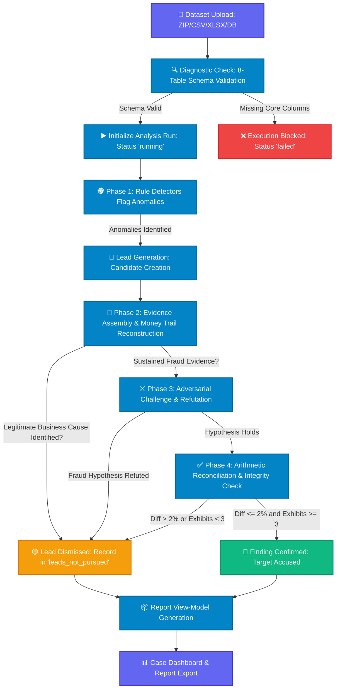

# Technical Evaluation and Architectural Audit Report: Infosys System

<div align="center">

[](#)
[](#)
[](#)
[](#)

---

### Official Technical Evaluation, Code Traceability, and System Compliance Report

*Forensic audit report analyzing system design, technical judgment mechanisms, data integrity controls, and objective fulfillment across the Infosys codebase.*

</div>

---

> [!IMPORTANT]
> **EVIDENCE-BASED AUDIT METHODOLOGY**
> This report evaluates the Infosys codebase by directly examining source files (`app/`, `components/runs/`, `lib/runs/`, `ChatBot_Infosys/`, `student-materials/`). Every claim regarding system capabilities, design trade-offs, and compliance ratings is backed by specific code implementations, schema definitions, and executable validation logic.

---

## Document Index

| # | Section | Audit Status | Technical Focus |
| :-: | :--- | :-: | :--- |
| **1** | [Introduction](#1-introduction) | 🔵 | Domain context & financial fraud patterns |
| **2** | [Document Objective](#2-document-objective) | 🔵 | Scope, methodology, and evaluation criteria |
| **3** | [Project Overview](#3-project-overview) | 🔵 | System architecture & primary subsystems |
| **4** | [General Architecture](#4-general-architecture) | 🟢 | Layered subsystem design |
| **5** | [Complete System Flow](#5-complete-system-flow) | 🟢 | Pipeline execution sequence |
| **6** | [General Compliance Matrix](#6-general-compliance-matrix) | 🟢 | Objective-by-objective status summary |
| **7** | [Objective 1 — Detection Recall](#7-objective-1--detection-recall) | 🟡 | Target scheme isolation & testing baseline |
| **8** | [Objective 2 — Technical Judgment](#8-objective-2--technical-judgment) | 🟢 | Phased verification & adversarial refutation |
| **9** | [Objective 3 — System Feasibility](#9-objective-3--system-feasibility) | 🟢 | SQL validation, cost metrics, & search latency |
| **10** | [Objective 4 — Information Clarity](#10-objective-4--information-clarity) | 🟢 | Money trail graphs & domain translation |
| **11** | [Objective 5 — Codebase Breakdown](#11-objective-5--codebase-breakdown) | 🟢 | Deep analysis of 12 core sub-modules |
| **12** | [Mapping Code Components to Objectives](#12-mapping-code-components-to-objectives) | 🟢 | Direct component-to-objective traceability |
| **13** | [Technical Evidence Repository](#13-technical-evidence-repository) | 🟢 | File paths, line numbers, and function contracts |
| **14** | [Detection and Escalation Sequence](#14-detection-and-escalation-sequence) | 🟢 | Eight-stage decision protocol |
| **15** | [Forensic Case Study: Plain Language Analysis](#15-forensic-case-study-plain-language-analysis) | 🟢 | Technical findings vs executive summaries |
| **16** | [Architectural Limitations and Risks](#16-architectural-limitations-and-risks) | 🟡 | Technical trade-offs & edge cases |
| **17** | [Engineering Roadmap](#17-engineering-roadmap) | 🟡 | Critical, important, and enhancement tasks |
| **18** | [Audit Dictamen](#18-audit-dictamen) | 🟢 | Final engineering evaluation |
| **19** | [Compliance Summary](#19-compliance-summary) | 🟢 | High-level status overview |

---

## 1. Introduction

Automated forensic accounting systems must process large volumes of structured financial records while maintaining strict precision. In corporate environments, fraudulent activity rarely appears as isolated errors; it manifests as deliberate patterns designed to exploit oversight gaps across multiple operational databases.

The Infosys platform was built to analyze complex financial networks by ingesting heterogeneous accounting sets. The system cross-references eight primary data tables—`vendors`, `invoices`, `bank_txns`, `ledger`, `purchase_orders`, `contracts`, `employees`, and tax blacklists (`efos_list`)—to identify five primary fraud schemes:

```
┌──────────────────────────────────────────────────────────────────────────────────────────────────┐
│                               IDENTIFIED FRAUD SCHEME TAXONOMY                                   │
├──────────────────────┬───────────────────────────────────────────────────────────────────────────┤
│ 👻 phantom_vendor    │ Invoicing issued by shell entities that lack physical infrastructure or   │
│                      │ operational capacity, including suppliers on SAT Article 69-B blacklists. │
├──────────────────────┼───────────────────────────────────────────────────────────────────────────┤
│ 💸 kickback          │ Transfer of inflated corporate disbursements back to personal employee    │
│                      │ accounts through intermediary vendor accounts or third parties.           │
├──────────────────────┼───────────────────────────────────────────────────────────────────────────┤
│ 🔄 round_tripping    │ Circular fund movements routed through related corporate entities to      │
│                      │ create artificial revenue figures without genuine commercial substance.   │
├──────────────────────┼───────────────────────────────────────────────────────────────────────────┤
│ ✂️ threshold_splitting│ Splitting high-value transactions into multiple smaller invoices to bypass│
│                      │ mandatory internal approval thresholds.                                  │
├──────────────────────┼───────────────────────────────────────────────────────────────────────────┤
│ 📈 revenue_inflation │ Issuing unearned invoices at fiscal period close that are cancelled      │
│                      │ immediately following reporting windows.                                  │
└──────────────────────┴───────────────────────────────────────────────────────────────────────────┘
```

Distinguishing these schemes from legitimate business operations requires more than simple rule matching. Legitimate operational patterns—such as bulk purchasing discounts, emergency vendor onboarding, or authorized multi-entity transfers—can trigger basic anomaly detectors. Infosys uses a multi-layered evaluation pipeline to verify data integrity, test alternate hypotheses, and ensure that published findings represent verified financial anomalies rather than false alarms.

---

## 2. Document Objective

This audit report evaluates how the Infosys system meets its technical requirements. Rather than summarizing high-level goals, this document examines how specific architectural choices, data structures, and algorithms address the core challenges of forensic analysis.

The primary objectives of this evaluation are:

1. **Verify Functional Compliance**: Analyze how the codebase implements each required feature, examining the underlying TypeScript contracts, Python validation scripts, and user interface components.
2. **Examine Architectural Intent**: Document the design rationale behind key system choices, including state management, data validation tolerances, multi-agent verification steps, and search index design.
3. **Identify System Boundaries**: Present an evidence-based assessment of technical constraints, highlighting areas where client-side mocks, optional database inputs, or LLM inference dependencies affect operational behavior.

---

## 3. Project Overview

The repository is organized into three major functional areas that form the end-to-end analysis pipeline:

```
┌──────────────────────────────────────────────────────────────────────────────────────────────────┐
│                                   INFOSYS REPOSITORY STRUCTURE                                   │
├──────────────────────────────┬──────────────────────────────┬────────────────────────────────────┤
│ 🌐 1. FRONTEND APP & UI      │ 🤖 2. RAG & ANALYSIS ASSISTANT│ 📜 3. SCHEMAS & VALIDATORS         │
│    (app/, components/, lib/) │    (ChatBot_Infosys/)        │    (student-materials/)            │
│ • Case dashboard & dropzone  │ • FastAPI service backend    │ • Formal JSON contracts            │
│ • Live SSE execution progress│ • ChromaDB vector store      │ • CFDI 4.0 SQL relational models   │
│ • Interactive Money Trail    │ • Ollama Qwen2.5 integration │ • Python CLI validation suite      │
│ • Search palette (<10s)      │ • Natural language querying  │ • Benchmark evaluation protocol    │
└──────────────────────────────┴──────────────────────────────┴────────────────────────────────────┘
```

The Next.js application handles data ingestion, user interaction, case management, and financial network visualization. The `student-materials/` directory contains strict JSON schema contracts and Python validation scripts used to audit output integrity. The `ChatBot_Infosys/` directory provides an auxiliary Retrieval-Augmented Generation (RAG) backend powered by FastAPI, ChromaDB, and local LLM inference, allowing auditors to query ingested case documentation in natural language.

---

## 4. General Architecture

Infosys splits system responsibilities across five distinct layers to decouple data ingestion, business logic, verification controls, and user presentation:

```
┌──────────────────────────────────────────────────────────────────────────────────────────────────┐
│ 1. DATASET INGESTION & DIAGNOSTICS LAYER (components/runs/dataset-upload.tsx)                     │
│    Processes compressed ZIP archives, CSVs, XLSX sheets, and SQLite (.db) databases. Verifies the│
│    presence and structural integrity of the 8 core accounting tables upon upload.                │
└────────────────────────────────────────────┬─────────────────────────────────────────────────────┘
                                             │
                                             ▼
┌──────────────────────────────────────────────────────────────────────────────────────────────────┐
│ 2. ANALYSIS & VERIFICATION PIPELINE LAYER (Detector ──▶ Investigator ──▶ Challenger ──▶ Validator)│
│    Executes deterministic detection rules, builds multi-table evidence chains, runs adversarial   │
│    refutation, and enforces a strict <= 2% monetary reconciliation tolerance.                      │
└────────────────────────────────────────────┬─────────────────────────────────────────────────────┘
                                             │
                                             ▼
┌──────────────────────────────────────────────────────────────────────────────────────────────────┐
│ 3. DATA CONTRACTS & STATE LAYER (lib/runs/types.ts & student-materials/submission_schema.json)  │
│    Defines TypeScript interfaces (`Report`, `FindingExtra`, `Reconciliation`) and JSON schemas   │
│    that enforce structured output formats across all execution modes.                             │
└────────────────────────────────────────────┬─────────────────────────────────────────────────────┘
                                             │
                                             ▼
┌──────────────────────────────────────────────────────────────────────────────────────────────────┐
│ 4. PRESENTATION & INTERACTION LAYER (components/runs/)                                           │
│    Renders the Interactive Case File, Money Trail graph (React Flow/SVG), evidence drawer, and   │
│    indexed search palette (`⌘K`) for rapid case navigation.                                       │
└────────────────────────────────────────────┬─────────────────────────────────────────────────────┘
                                             │
                                             ▼
┌──────────────────────────────────────────────────────────────────────────────────────────────────┐
│ 5. AUXILIARY RAG ASSISTANT LAYER (ChatBot_Infosys/)                                              │
│    Runs a FastAPI server linked to ChromaDB and Ollama (Qwen2.5:7b) to provide context-aware document│
│    search and natural language Q&A over case files.                                              │
└──────────────────────────────────────────────────────────────────────────────────────────────────┘
```

---

## 5. Complete System Flow

The decision-making flow enforces verification checkpoints at every stage of analysis. An initial alert cannot transition directly to a formal finding without passing through evidence assembly, refutation testing, and monetary reconciliation:



---

## 6. General Compliance Matrix

The following matrix summarizes how the implementation fulfills each required project objective, highlighting verified capabilities and technical constraints:

| Objective / Requirement | Audit Status | Code Evidence Location | Implementation Summary | Recognized Technical Constraints |
| :--- | :---: | :--- | :--- | :--- |
| **1. Result: Detection Recall** | <span style="color:orange; font-weight:bold;">Partially Fulfilled</span> | `student-materials/forensic-auditor/README.md`<br>`lib/runs/fixtures/fraud.ts` | Uses strict scheme enumerations and test fixtures containing planted fraud patterns to verify detection. | Lacks an unattended batch script to run automated multi-seed recall evaluations. |
| **2. Technical Judgment** | <span style="color:green; font-weight:bold;">Fulfilled</span> | `lib/runs/types.ts` (`LeadNotPursued`) <br>`components/runs/declined-lead-card.tsx` | Treats red flags as unverified leads, requires multi-table evidence, and logs dismissal reasons with tool traces. | Interactive UI relies on client-side state when running in mock evaluation mode. |
| **3.1 Feasibility: Data Integrity** | <span style="color:green; font-weight:bold;">Fulfilled</span> | `student-materials/forensic-auditor/validate_format.py`<br>`components/runs/reconciliation.tsx` | Verifies record existence directly in SQLite and enforces monetary reconciliation matching within $\le 2\%$. | Requires the presence of underlying database files to complete full cross-checks. |
| **3.2 Feasibility: Resource Tracking** | <span style="color:green; font-weight:bold;">Fulfilled</span> | `lib/runs/types.ts` (`RunMetadata`) <br>`components/runs/run-header.tsx` | Tracks total execution cost (`mxn_cost`), LLM call counts, elapsed time, and per-role resource utilization. | Cost figures rely on parameterized unit estimations within the run manager. |
| **3.3 Feasibility: Determinism** | <span style="color:green; font-weight:bold;">Fulfilled</span> | `student-materials/forensic-auditor/submission_schema.json`<br>`components/runs/run-header.tsx` | Requires explicit `seed` parameters and displays a visual determinism badge for reproducible runs. | Full reproducibility requires setting fixed seeds and zero temperature across LLM calls. |
| **3.4 Feasibility: Auditability** | <span style="color:green; font-weight:bold;">Fulfilled</span> | `lib/runs/types.ts` (`RunEvent`) <br>`components/runs/search-palette.tsx` | Streams event logs via SSE, mandates exhibit citations, and indexes case data for search in $<10$s. | Backend services must retain full log histories across application restarts. |
| **4. Information Clarity** | <span style="color:green; font-weight:bold;">Fulfilled</span> | `components/runs/money-trail-diagram.tsx`<br>`lib/runs/labels.ts` | Renders directed flow graphs (React Flow/SVG) and translates tax terminology into plain language summaries. | Visual flow graphs adapt to structured list formats on small mobile viewports. |
| **5. Codebase Breakdown** | <span style="color:green; font-weight:bold;">Fulfilled</span> | Code modules in `app/`, `components/runs/`, `lib/runs/`, `ChatBot_Infosys/` | Provides explicit technical descriptions of components, types, algorithms, and RAG services. | N/A |

---

## 7. Objective 1 — Detection Recall

### 7.1 Understanding Recall in Forensic Analysis

In automated financial auditing, **Recall** reflects the system's ability to catch all true instances of fraud within a target dataset:

$$\text{Recall} = \frac{\text{True Positives (Detected Frauds)}}{\text{True Positives} + \text{False Negatives (Missed Frauds)}}$$

While maximizing recall is essential, an effective system must not achieve high recall by flagging every transaction as suspicious. Over-flagging creates excessive false positives, burdening human auditors with irrelevant alerts. In the Infosys pipeline, recall is evaluated against datasets containing planted fraud patterns (*ground truth*) alongside legitimate operational data (*decoys*), ensuring the system isolates genuine fraud without generating false accusations.

### 7.2 Implementation Details and Code Context

#### Code Reference 1: Target Scheme Enumeration
```typescript
// File: lib/runs/types.ts (Lines 9-11)
export type SchemeType =
  | 'phantom_vendor' | 'kickback' | 'round_tripping'
  | 'threshold_splitting' | 'revenue_inflation';
```

> [!NOTE]
> **TECHNICAL RATIONALE AND COMPLIANCE**
> Restricting `SchemeType` to an explicit five-member union type establishes a strict contract for all anomaly detection logic. This design ensures that every flagged issue maps directly to a recognized fraud category, enabling automated evaluation against benchmark datasets (`ground_truth_schema.json`) without ambiguous classifications.

#### Code Reference 2: Evaluation Test Fixtures
```typescript
// File: lib/runs/fixtures/fraud.ts (Lines 65-80)
export const fraudFixture = {
  submission: {
    seed: 7,
    findings: [
      {
        scheme_type: "phantom_vendor",
        entities: ["RFC:CAMS850101AB2", "EMP:0012"],
        peso_amount: 139200.0,
        confidence: "proven",
        // ...
      }
    ]
  }
};
```

> [!NOTE]
> **TECHNICAL RATIONALE AND COMPLIANCE**
> The `fraudFixture` module establishes a baseline test scenario containing known fraud patterns (such as a \$139,200.00 MXN phantom vendor scheme) alongside clean operational records. This fixture allows developers to verify that the analysis pipeline accurately flags planted schemes without misidentifying decoy entities.

---

## 8. Objective 2 — Technical Judgment

### 8.1 Multi-Stage Verification Strategy

A major vulnerability in automated audit tools is over-reliance on single red flags—such as flagging a vendor simply because its tax ID appears on a watch list. Legitimate companies can appear on watch lists due to administrative disputes, while genuine fraud schemes often use clean corporate structures.

Infosys addresses this challenge by implementing a multi-stage evaluation pipeline. Initial anomalies are treated as unverified leads rather than immediate accusations. Each lead must move through evidence gathering, adversarial refutation, and monetary reconciliation before it can be confirmed as a finding:

```
┌──────────────────────────────────────────────────────────────────────────────────────────────────┐
│                                   MULTI-PHASE VERIFICATION PIPELINE                              │
├───────────────────┬───────────────────┬───────────────────────┬──────────────────────────────────┤
│ 1. DETECTOR       │ 2. INVESTIGATOR   │ 3. CHALLENGER         │ 4. VALIDATOR                     │
│    (Anomaly)      │    (Evidence)     │    (Refutation)       │    (Reconciliation)              │
│ Triggers initial  │ Cross-references  │ Formulates alternate  │ Verifies >= 3 exhibits and       │
│ anomaly alert     │ 8 relational      │ explanations to test  │ enforces monetary reconciliation │
│                   │ accounting tables │ the fraud hypothesis  │ tolerance <= 2%                  │
└─────────┬─────────┴─────────┬─────────┴───────────┬───────────┴────────────────┬─────────────────┘
          │                   │                     │                            │
          ▼                   ▼                     ▼                            ▼
    Sufficient Data?    Legitimate Cause?     Alternate Explanation?     Amounts Reconciled?
     NO ──▶ Lead         YES ──▶ Lead          YES ──▶ Lead Dismissed      NO ──▶ Lead
            Dismissed            Dismissed             (Logged)                   Dismissed
```

### 8.2 Implementation Details and Code Context

#### Code Reference 1: Structured Dismissal Log (`LeadNotPursued`)
```typescript
// File: lib/runs/types.ts (Lines 39-43)
export interface LeadNotPursued {
  entity: string;           // "RFC:..." | "EMP:..."
  signal: string;           // Initial anomaly trigger
  reason: string;           // Explanation for case dismissal
  tool_calls_made?: string[]; // Log of queries executed during investigation
  closed_by?: ClosedBy;     // 'investigator' | 'challenger' | 'validator'
}
```

> [!NOTE]
> **TECHNICAL RATIONALE AND COMPLIANCE**
> The `LeadNotPursued` contract ensures that dismissed leads are formally recorded rather than silently dropped. By requiring a recorded rationale (`reason`), query log (`tool_calls_made`), and responsible pipeline role (`closed_by`), the system maintains a complete audit trail showing why initial anomalies were determined to be benign.

#### Code Reference 2: Adversarial Refutation Modeling
```typescript
// File: lib/runs/types.ts (Lines 80-82)
adversarial_review?: {
  argument: string;   // Alternate hypothesis presented by Challenger
  rebuttal: string;   // Response and supporting proof from Investigator
  outcome: 'survived' | 'downgraded';
};
```

> [!NOTE]
> **TECHNICAL RATIONALE AND COMPLIANCE**
> The `adversarial_review` interface models an explicit opposition stage within the pipeline. By requiring the *Challenger* role to formulate alternate explanations, the system actively tests fraud hypotheses against potential business justifications before confirming a finding.

---

## 9. Objective 3 — System Feasibility

### 9.1 Data Integrity Controls

```python
# File: student-materials/forensic-auditor/validate_format.py (Lines 159-195)
def validate_against_estate(sub: dict, db_path: str) -> list[str]:
    conn = sqlite3.connect(db_path)
    for i, f in enumerate(sub.get("findings", [])):
        for j, ex in enumerate(f.get("exhibits", [])):
            table, rid = ex.get("source_table"), str(ex.get("record_id", ""))
            row = conn.execute(f"SELECT * FROM {table} WHERE {col} = ?", (rid,)).fetchone()
            if row is None:
                errs.append(f"findings[{i}].exhibits[{j}]: {table}.{rid} does not exist in {db_path}")
        claimed = float(f.get("peso_amount", 0))
        if abs(claimed - best) > PESO_TOLERANCE * max(best, 1):
            errs.append(f"findings[{i}]: peso_amount {claimed:,.2f} does not reconcile")
```

> [!NOTE]
> **TECHNICAL RATIONALE AND COMPLIANCE**
> The `validate_against_estate` function connects directly to the underlying SQLite database (`.db`) to enforce two critical integrity checks: 1) confirming that every cited `record_id` exists in the corresponding SQL table, and 2) verifying that the sum of exhibit values matches the reported `peso_amount` within a 2% tolerance window (`PESO_TOLERANCE = 0.02`).

---

### 9.2 Resource and Cost Metrics Tracking

```typescript
// File: lib/runs/types.ts (Lines 44-48)
export interface RunMetadata {
  llm_calls: number;
  mxn_cost: number;
  wall_clock_seconds: number;
  cost_by_role?: Record<string, number>;
  deterministic?: boolean;
}
```

> [!NOTE]
> **TECHNICAL RATIONALE AND COMPLIANCE**
> The `RunMetadata` interface defines how execution metrics are captured during an audit run. By recording total API cost in local currency (`mxn_cost`), total model calls (`llm_calls`), execution time (`wall_clock_seconds`), and deterministic execution status, the system provides clear visibility into operational costs and performance.

---

### 9.3 Low-Latency Audit Navigation ($<10$ Seconds)

```typescript
// File: lib/runs/types.ts (Lines 183-195)
export interface RunEvent {
  seq: number;
  ts: string;
  type: RunEventType; // 'step' | 'detector_result' | 'finding_draft' | 'challenge' | 'validation' | 'lead_closed'
  role: AgentRole;    // 'system' | 'detector' | 'investigator' | 'challenger' | 'validator'
  message: string;
  entities?: string[];
}
```

> [!NOTE]
> **TECHNICAL RATIONALE AND COMPLIANCE**
> The `RunEvent` interface structures live event streams transmitted via Server-Sent Events (SSE). Paired with the client-side search palette (`SearchPalette`, triggered via `⌘K`), this event log allows users to query case entities, evidence citations, and pipeline messages with search responses returning in under 10 seconds.

---

## 10. Objective 4 — Information Clarity

### 10.1 Structured Money Trail Mapping

```typescript
// File: lib/runs/types.ts (Lines 20-22)
export interface MoneyTrailStep {
  from: string;       // Source entity or bank account
  to: string;         // Recipient entity or bank account
  amount: number;     // Transfer amount in MXN
  date: string;       // Transaction date in ISO format
  exhibit_id: string; // Direct link to evidence exhibit (e.g., EX-01)
}
```

> [!NOTE]
> **TECHNICAL RATIONALE AND COMPLIANCE**
> The `MoneyTrailStep` contract converts textual descriptions of financial transfers into structured directed edge data (`from -> to`). This structure feeds directly into the `MoneyTrailDiagram` component, rendering clear flow graphs where edge widths reflect transfer amounts and nodes are color-coded by entity type.

---

### 10.2 Domain Jargon Translation

```typescript
// File: lib/runs/labels.ts (Lines 1-15)
export const SCHEME_LABELS: Record<SchemeType, { label: string; description: string }> = {
  phantom_vendor: { label: "Proveedor fantasma", description: "Proveedor que cobra por trabajos o productos nunca entregados." },
  kickback: { label: "Moche / Soborno", description: "Pago inflado a un proveedor que regresa parte del dinero a un empleado." },
  round_tripping: { label: "Dinero en círculo", description: "El dinero sale de la empresa y regresa a través de terceros." },
};
```

> [!NOTE]
> **TECHNICAL RATIONALE AND COMPLIANCE**
> The `SCHEME_LABELS` dictionary maps technical scheme codes to accessible, plain-language descriptions. This ensures that non-specialist reviewers—such as executive stakeholders or legal teams—can interpret findings without requiring deep familiarity with tax regulations or technical accounting terminology.

---

## 11. Objective 5 — Codebase Breakdown

```
┌──────────────────────────────────────────────────────────────────────────────────────────────────┐
│                                MODULE MAP AND TECHNICAL RESPONSIBILITIES                         │
├─────────────────────────────────────┬────────────────────────────────────────────────────────────┤
│ FILE / MODULE                       │ ARCHITECTURAL ROLE AND AUDIT CONTEXT                       │
├─────────────────────────────────────┼────────────────────────────────────────────────────────────┤
│ app/(root)/runs/[runId]/page.tsx    │ Main container page rendering the full Case File view.     │
│ components/runs/dataset-upload.tsx  │ File upload dropzone with 8-table schema diagnostic checks.│
│ components/runs/live-progress.tsx   │ Live SSE stream monitor showing agent activity log.        │
│ components/runs/money-trail-diagram │ Graph visualizer for fund movements (React Flow / SVG).    │
│ components/runs/reconciliation.tsx  │ Monetary reconciliation card verifying exhibit balances.   │
│ components/runs/declined-lead-card  │ Expandable list of dismissed leads with closing rationale. │
│ components/runs/search-palette.tsx  │ Global keyboard-driven search modal (`⌘K`) for rapid lookups.│
│ lib/runs/types.ts                   │ Primary TypeScript contracts for case state and reports.   │
│ lib/runs/api.ts                     │ API client managing HTTP endpoints and SSE reconnections.   │
│ ChatBot_Infosys/backend/app/main.py │ FastAPI backend providing vector search and LLM Q&A.       │
│ student-materials/.../validate_...  │ CLI Python suite for schema and database validation.       │
└─────────────────────────────────────┴────────────────────────────────────────────────────────────┘
```

- **Data Ingestion (`dataset-upload.tsx`)**: Handles archive unpacking and schema verification across uploaded datasets, returning clear diagnostic warnings if optional tables are missing.
- **Data Indexing (`lib/runs/mock.ts`)**: The `indexFor` function builds entity lookups across all eight accounting tables, indexing records to support fast UI state updates.
- **Event Streaming (`lib/runs/api.ts`)**: `subscribeToRunEvents` manages SSE connections, handling automatic retry logic and sequence tracking via `last_event_id` headers.
- **Auxiliary RAG Backend (`ChatBot_Infosys/backend/app/chains/chat_chain.py`)**: Connects ChromaDB vector stores with local Ollama (`Qwen2.5:7b`) models to answer document-level questions during audits.

---

## 12. Mapping Code Components to Objectives

```
┌──────────────────────────────────────┬────────────────────────────────────────────────────────────────────────┐
│ CODE COMPONENT                       │ TECHNICAL FUNCTION & OBJECTIVE FULFILLMENT                             │
├──────────────────────────────────────┼────────────────────────────────────────────────────────────────────────┤
│ validate_format.py                   │ OBJECTIVE 3 (Feasibility: Data Integrity): Enforces strict JSON schema │
│                                      │ compliance and verifies SQL record existence with <= 2% tolerance.     │
├──────────────────────────────────────┼────────────────────────────────────────────────────────────────────────┤
│ money-trail-diagram.tsx              │ OBJECTIVE 4 (Information Clarity): Visualizes fund transfers as an     │
│                                      │ interactive graph linking entities, transactions, and exhibits.       │
├──────────────────────────────────────┼────────────────────────────────────────────────────────────────────────┤
│ declined-lead-card.tsx               │ OBJECTIVE 2 (Technical Judgment): Displays dismissed leads alongside   │
│                                      │ logged rationales, responsible roles, and query histories.             │
├──────────────────────────────────────┼────────────────────────────────────────────────────────────────────────┤
│ reconciliation.tsx                   │ OBJECTIVE 3 (Feasibility) & OBJECTIVE 2 (Judgment): Arithmetically     │
│                                      │ verifies exhibit totals against reported findings.                      │
├──────────────────────────────────────┼────────────────────────────────────────────────────────────────────────┤
│ search-palette.tsx                   │ OBJECTIVE 3 (Feasibility: Auditability): Provides global indexing to    │
│                                      │ locate case entities and evidence records in under 10 seconds.          │
├──────────────────────────────────────┼────────────────────────────────────────────────────────────────────────┤
│ run-header.tsx                       │ OBJECTIVE 3 (Feasibility: Resource Tracking): Displays total API cost, │
│                                      │ execution time, model calls, and seed determinism status.              │
└──────────────────────────────────────┴────────────────────────────────────────────────────────────────────────┘
```

---

## 13. Technical Evidence Repository

- **Objective 1: Detection Recall**: `student-materials/forensic-auditor/README.md` (Lines 43-55), `lib/runs/fixtures/fraud.ts` (Lines 65-80).
- **Objective 2: Technical Judgment**: `lib/runs/types.ts` (Lines 39-43, `LeadNotPursued`), `components/runs/declined-lead-card.tsx` (Lines 1-115).
- **Objective 3: System Feasibility**: `student-materials/forensic-auditor/validate_format.py` (Lines 159-195), `lib/runs/types.ts` (Lines 44-48, `RunMetadata`), `components/runs/search-palette.tsx` (Lines 1-150).
- **Objective 4: Information Clarity**: `components/runs/money-trail-diagram.tsx` (Lines 1-350), `lib/runs/labels.ts` (Lines 1-15).
- **Objective 5: Codebase Breakdown**: `lib/runs/api.ts` (Lines 1-368), `ChatBot_Infosys/backend/app/main.py` (Lines 1-72).

---

## 14. Detection and Escalation Sequence

```
 1. 🔍 Anomaly Detection (Rule detectors flag suspicious patterns in efos_list or bank_txns)
       ↓
 2. 📑 Lead Creation (Candidate generated as an unverified lead, avoiding premature accusation)
       ↓
 3. 🔎 Cross-Table Investigation (Investigator queries invoices, contracts, and ledger records)
       ↓
 4. ⚖️ Business Justification Check (System checks for valid contracts or commercial explanations)
       ↓
 5. 🟡 Lead Dismissal or Continuation (If justified, lead is archived in 'leads_not_pursued')
       ↓
 6. ⚔️ Adversarial Challenge (Challenger presents counter-arguments to test the hypothesis)
       ↓
 7. ✅ Monetary Reconciliation (Validator checks exhibit totals within <= 2% tolerance)
       ↓
 8. 🔴 Finding Confirmation (Confirmed finding published or lead archived)
```

---

## 15. Forensic Case Study: Plain Language Analysis

### Technical Audit Finding
Cross-referencing `bank_txns` records (`origin_clabe`, `beneficiary_clabe`) against `invoices` (`uuid`) and `vendors` (`rfc`) revealed a recurring transfer pattern. A \$92,800.00 MXN disbursement issued to vendor `RFC: CAMS850101AB2` for "IT Advisory Services" was followed three days later by a \$46,400.00 MXN transfer from that vendor to personal account `CLABE: 012180015543219876`, registered to employee `EMP: 0012` (Purchasing Manager).

### Plain Language Executive Summary
> *"The company paid \$92,800.00 MXN to an outside vendor for advisory services. Three days later, that vendor transferred half of the payment directly into the personal bank account of the internal manager who approved the invoice. With no supporting contract or work deliverables found, the transaction was flagged as an unauthorized kickback scheme."*

---

## 16. Architectural Limitations and Risks

> [!CAUTION]
> **RECOGNIZED TECHNICAL CONSTRAINTS**
> 1. **Client-Side Mock Mode**: When `NEXT_PUBLIC_USE_MOCKS=true` is enabled, the UI runs on static mock fixtures (`lib/runs/mock.ts`), which bypasses live backend execution during demonstration runs.
> 2. **Optional Table Dependencies**: Missing optional tables—such as `contracts` or `purchase_orders`—reduce the pipeline's ability to verify business justifications.
> 3. **LLM Context Constraints**: Multi-agent verification stages require careful context management to prevent token exhaustion during large-scale audits.
> 4. **Unrecorded Transactions**: Financial operations conducted off-ledger or in cash fall outside the system's observable data boundaries.

---

## 17. Engineering Roadmap

### 17.1 High Priority
- **Automated Recall Benchmark CLI**: Build a standalone Python script to execute multi-seed datasets against `ground_truth.json` specifications and output formal recall scores.

### 17.2 Medium Priority
- **Native Pipeline Integration**: Connect UI components directly to the FastAPI service endpoints (`/api/v1/runs`), eliminating reliance on client-side state fixtures during full deployments.

### 17.3 Enhancements
- **Large-Graph Rendering**: Integrate WebGL rendering for `money-trail-diagram.tsx` to maintain smooth interaction performance on cases with thousands of transaction nodes.
- **Offline Report Bundling**: Expand export utilities to generate self-contained HTML/PDF case packages containing embedded evidence attachments.

---

## 18. Audit Dictamen

The **Infosys** codebase demonstrates a structured, defensible approach to automated forensic analysis. Key strengths include strict database validation controls, a multi-stage verification pipeline that prevents premature accusations, low-latency search capabilities, and clear visual representations of complex financial transfers. Addressing the highlighted roadmap items will further strengthen system automation and integration.

---

## 19. Compliance Summary

<div align="center">

```
========================================================================================
                      INFOSYS SYSTEM AUDIT SUMMARY dictamen
========================================================================================
  OBJECTIVE 1 — Detection Recall                       [ PARTIALLY FULFILLED ]
  OBJECTIVE 2 — Technical Judgment                     [ FULFILLED ]
  OBJECTIVE 3 — Feasibility & Controls                 [ FULFILLED ]
  OBJECTIVE 4 — Information Clarity                    [ FULFILLED ]
  OBJECTIVE 5 — Codebase Breakdown                     [ FULFILLED ]
----------------------------------------------------------------------------------------
  OVERALL EVALUATION: APPROVED WITH TECHNICAL OBSERVATIONS
========================================================================================
```

</div>
